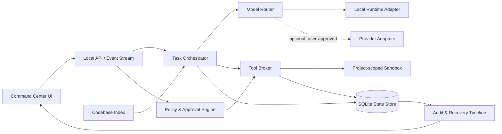
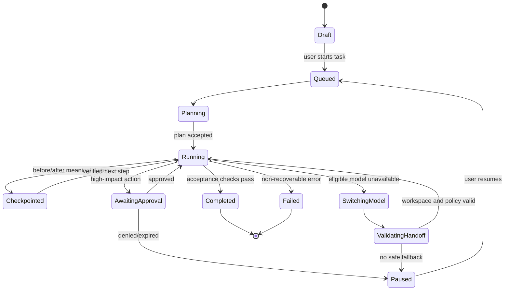

# Continuity Agent System Architecture

## Architectural principle

The model never owns authority. It proposes plans and tool calls; independent local services enforce policy, execute allowed tools, persist evidence, and decide whether work can safely continue.

## Component map



## Responsibilities and trust boundaries

| Module | Responsibility | Must never do |
|---|---|---|
| Command Center UI | Gather user intent; show plan, policy, progress, diffs, checkpoints, and recovery actions. | Execute privileged work directly or hide a provider/model switch. |
| Local API | Validate requests, serve state, and stream events to the UI. | Interpret model output as authorization. |
| Task Orchestrator | Move a task through small planned steps; request model output; coordinate checkpoints and verification. | Directly access unrestricted host tools or secrets. |
| Policy and Approval Engine | Evaluate path, command, network, spend, privacy, and approval policy for each proposed action. | Be modified by the active model or a retrieved document. |
| Model Router | Select an eligible model by capability, health, privacy, budget, and fallback order. | Switch to an unapproved provider, privacy tier, or cost tier. |
| Provider Adapter | Convert the internal request/response contract to a local or permitted provider API. | Store provider credentials in prompts, task logs, or source files. |
| Tool Broker | Validate structured tool calls and execute only authorized capabilities. | Pass raw shell strings or broad filesystem authority to a model. |
| Sandbox | Isolate terminal/browser/file operations to an approved project workspace. | Mount the host home directory, keychain, or unrelated projects. |
| State Store | Persist task state, evidence, checkpoints, policies, and audit trail. | Silently overwrite completed evidence. |
| Codebase Index | Retrieve relevant approved code context and produce bounded summaries. | Treat indexed content as trusted instructions. |

## Task lifecycle



## Canonical data contracts

### Task

```json
{
  "id": "uuid",
  "goal": "user-owned task outcome",
  "projectId": "uuid",
  "status": "draft|queued|planning|running|awaiting_approval|switching_model|paused|completed|failed",
  "activeModel": { "provider": "ollama", "modelId": "local-model", "version": "resolved-id" },
  "policySnapshotId": "uuid",
  "createdAt": "ISO-8601",
  "updatedAt": "ISO-8601"
}
```

### Checkpoint

```json
{
  "id": "uuid",
  "taskId": "uuid",
  "sequence": 14,
  "reason": "tool_completed|model_switch|approval_required|manual",
  "plan": { "completed": ["..."], "next": "...", "openRisks": ["..."] },
  "workspace": { "revision": "git-head-or-file-manifest", "changedFiles": ["path"] },
  "evidence": { "toolActionIds": ["uuid"], "testRunIds": ["uuid"] },
  "modelContext": { "summary": "bounded handoff summary", "contextRefs": ["index-ref"] },
  "integrityHash": "sha256",
  "createdAt": "ISO-8601"
}
```

### Proposed tool action

```json
{
  "id": "uuid",
  "taskId": "uuid",
  "capability": "file.read|file.write|terminal.run|browser.navigate",
  "arguments": {},
  "risk": "low|medium|high",
  "idempotencyKey": "stable-hash",
  "policyDecision": "pending|allowed|requires_approval|denied",
  "result": { "status": "pending|success|failure", "summary": "..." }
}
```

### Model capability record

```json
{
  "provider": "ollama",
  "modelId": "model-name",
  "capabilities": ["text", "tools", "code"],
  "contextLimit": 0,
  "privacyTier": "local_only",
  "health": "healthy|degraded|unavailable",
  "routingClass": "primary|fallback|support_only",
  "lastCheckedAt": "ISO-8601"
}
```

## Handoff protocol

1. The orchestrator pauses before a new model receives control.
2. The state store writes a checkpoint with exact workspace evidence and the next safe action.
3. The router excludes models that fail capability, privacy, budget, or policy checks.
4. The adapter gives the chosen model a bounded handoff packet—goal, completed work, tests, risks, relevant context, and next action.
5. The replacement model validates the workspace through read-only tools first.
6. Only then does the orchestrator transition back to `running` and notify the UI.

## Local-first deployment model

The first release runs as a single-user process on `127.0.0.1`, with the project root explicitly scoped. Local model access uses a loopback endpoint. SQLite and the code index live in application-managed storage under the approved project directory. Cloud adapters are absent by default and require future explicit provider configuration.

## Architectural decisions for the next implementation steps

1. Replace JSON persistence with SQLite before multi-step agent execution is expanded.
2. Split the current server into API, orchestrator, router, policy, tool broker, and storage modules.
3. Replace default file writes with a proposed-change and user-approval flow.
4. Add a local-runtime capability probe before accepting a model as a fallback.
5. Implement the state machine and checkpoint integrity hash before parallel tasks or cloud adapters.
